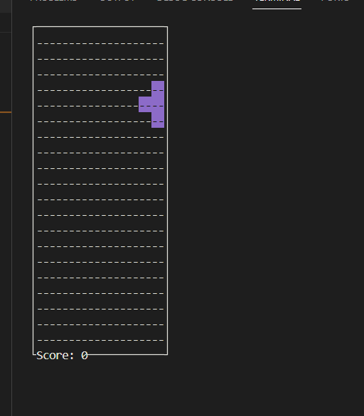
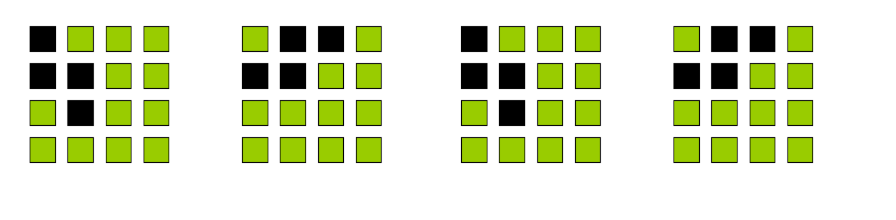
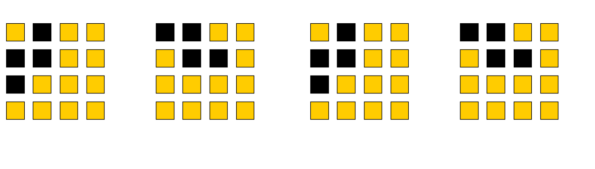
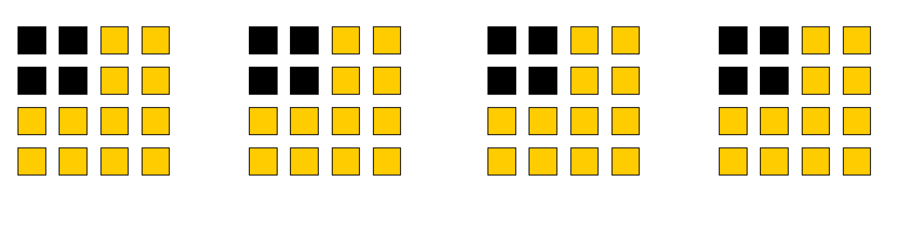
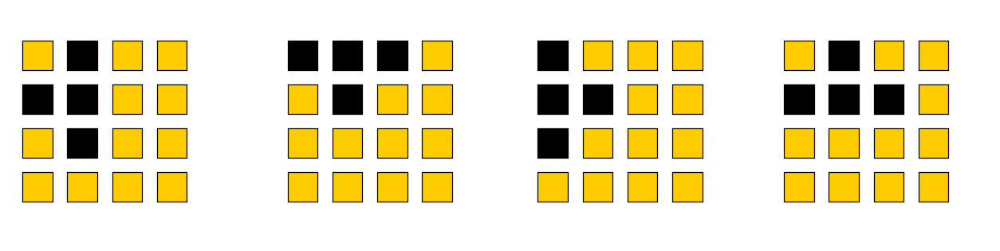
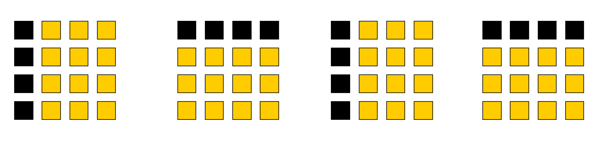

[toc]

# 一、ncurse的使用
在C语言中，你可以使用#include <curses.h>来包含ncurses库的头文件，并使用其中的函数和数据结构。以下是一些常用接口和函数的示例：

初始化和清理：

initscr(): 初始化curses库，准备创建终端界面。
endwin(): 清理并关闭curses库，恢复终端到正常状态。
屏幕输出：

printw(const char *format, ...): 在屏幕上打印格式化的文本。
mvprintw(int y, int x, const char *format, ...): 在指定位置打印格式化的文本。
refresh(): 刷新屏幕，使之显示最新的更改。
输入处理：

getch(): 从用户获取一个字符输入。
mvgetch(int y, int x): 从指定位置获取一个字符输入。
光标控制：

move(int y, int x): 将光标移动到指定位置。
getyx(WINDOW *win, int y, int x): 获取当前光标位置。
窗口和边框：

WINDOW *newwin(int nlines, int ncols, int begin_y, int begin_x): 创建一个新的窗口。
box(WINDOW *win, chtype verch, chtype horch): 在窗口周围绘制边框。
颜色和属性：

start_color(): 启用颜色功能。
init_pair(short pair, short f, short b): 初始化颜色对。
attron(chtype attrs): 打开指定属性。
attroff(chtype attrs): 关闭指定属性。

int resizeterm(int lines, int columns): 调整终端窗口
int noecho(void); -- 用于控制终端上键盘输入字符的回显行为。当调用 noecho 函数后，键盘输入的字符将不会在终端上显示（不回显），而是直接传递给程序处理。
curs_set(0); // 用于隐藏光标的显示

```
要在 ncurses 窗口内添加文本或其他元素，你可以使用以下几个函数：

mvprintw：在指定位置打印格式化的字符串。
wprintw：在窗口内指定位置打印格式化的字符串。
mvwprintw：在窗口内移动光标到指定位置，并打印格式化的字符串。
mvwaddch：在窗口内移动光标到指定位置，并添加字符。
mvwaddstr：在窗口内移动光标到指定位置，并添加字符串。
mvwaddnstr：在窗口内移动光标到指定位置，并添加指定长度的字符串。
wborder：在窗口周围绘制边框。
wattron 和 wattroff：为窗口启用或禁用文本属性，如粗体、下划线、反转等。
wmove：在窗口内移动光标到指定位置。
```


```
    // 初始化 ncurses
    initscr();

    // 创建一个新的窗口
    WINDOW *win = newwin(10, 30, 5, 5);
    box(win, 0, 0);

    // 在标准屏幕上绘制内容
    mvprintw(0, 0, "Hello, ncurses!");

    // 刷新整个屏幕
    refresh();

    // 在窗口内绘制内容
    mvwprintw(win, 1, 1, "Hello, window!");

    // 刷新窗口
    wrefresh(win);

    // 等待用户按任意键
    getch();

    // 清理 ncurses
    endwin();
```

### 画板着色

在代码`attron(262176 | board[i][j] << 8);`中，不同的board[i][j]值会绘制不同的颜色，
board[i][j]值：是这个顺序
#define COLOR_BLACK	0
#define COLOR_RED	1
#define COLOR_GREEN	2
#define COLOR_YELLOW	3
#define COLOR_BLUE	4
#define COLOR_MAGENTA	5
#define COLOR_CYAN	6
#define COLOR_WHITE	7


# 二、cmake编译处理

file(GLOB SRC_FILES *.c *.cpp)
该命令用于在指定目录中获取符合指定模式的文件列表。它会在构建系统生成期间执行一次，并将符合模式的文件路径匹配到一个变量中。这个命令不会递归地搜索子目录，只会在指定目录中进行匹配

file(GLOB_RECURSE SRC_FILES *.c *.cpp)
它会递归地搜索指定目录及其子目录中符合模式的文件。它会在构建系统生成期间执行一次，并将符合模式的文件路径匹配到一个变量中。

# 三、俄罗斯方块逻辑实现
规格：
- 有七个规定形状的方块
- 在一个画板区域内，左、右、下为封闭区域，方块每次从上面落下
- 落下过程中，遇到阻挡后当前快停止落下；开始生成下一个随机块，并下落；
- 落下过程中，当前一整行满了后，当前行消失，表示成功积满一行，并且上面的所有行依次往下落一行；落行过程中，满行状态判断继续生效；
- 当某个块下落碰触阻挡，并且高度触碰顶部时，游戏失败；
- wasd键可以控制  方块在下落过程中，旋转、左、下、右变动；

## 1.方块定义
### 1) 方块个数 piece num
方块：游戏中使用七种不同形状的方块，每个方块由四个小方块（俄罗斯方块）组成。每个小方块都由一个颜色标识。玩家可以左右移动方块，将其向下加速下落，并旋转方块的方向。

### 2) 方块形状
- 采用逐行扫描的形式，每次更新出整个窗口的布局、所有piece的形状、颜色；


## 3)piece color
七个不同的方块，每个方块一种颜色

```
int g_block[7][4] = {
    {431424, 598356, 431424, 598356},
    {427089, 615696, 427089, 615696},
    {348480, 348480, 348480, 348480},
    {599636, 431376, 598336, 432192},
    {411985, 610832, 415808, 595540},
    {247872, 799248, 247872, 799248},
    {614928, 399424, 615744, 428369}
};
```
g_block[0]: 闪电1
- 431424
    - 0110 1001 0101 0100 0000
    - 12    21    11   10  00
    - w - 1 = 1 所以 w = 2 w表示高度
    - h - 1 = 2 所以 h = 3 h表示高度

- 598356
    - 1001 0010 0001 0101 0100
    - 21   02    01   11   10

- 431424
    - 0110 1001 0101 0100 0000
    - 12    21    11   10  00

- 598356
    - 1001 0010 0001 0101 0100
    - 21   02    01   11   10



g_block[1]:闪电2
- 427089
    - 0110 1000 0100 0101 0001
    - 0110 1000 0100 0101 0001
    - 12    20   10   11   01
- 615696
    - 1001 0110 0101 0001 0000
    - 21    12   11   01  00
- 427089
- 615696


g_block[2]:正方形
- 348480
    - 0101 0101 0001 0100 0000
    - 11    11   01   10   00
- 348480
- 348480
- 348480



g_block[3]:拐形1
- 599636
    - 1001 0010 0110 0101 0100
    - 21    02   12   11   10
- 431376
    - 0110 1001 0101 0001 0000
    - 12    21   11   01  00
- 598336
    - 1001 0010 0001 0100 0000
    - 21    02   01  10   00
- 432192
    - 0110 1001 1000 0100 0000
    - 12   21    20   10  00


g_block[4]:坦克形
- 411985
    - 0110 0100 1001 0101 0001
    - 12    10   21   11   01
- 610832
    - 1001 0101 0010 0001 0000
    - 21    11   02   01  00
- 415808
    - 0110 0101 1000 0100 0000
    - 12    11   20  10   00
- 595540
    - 1001 0001 0110 0101 0100
    - 21   01    12   11  10


g_block[5]:条形
- 247872
    - 0011 1100 1000 0100 0000
    - 03    30   20   10   00
- 799248
    - 1100 0011 0010 0001 0000
    - 30    03   02   01  00
- 247872
- 799248


g_block[6]:拐形2
- 614928
    - 1001 0110 0010 0001 0000
    - 21    12   02   01   00
- 399424
    - 0110 0001 1000 0100 0000
    - 12    01   20   10  00
- 615744
    - 1001 0110 0101 0100 0000
    - 21    12   11   10  00
- 428369
    - 0110 1000 1001 0101 0001
    - 12    20   21   11  01


## 2.方块移动逻辑

## 3.整行消除，计分、结束判定和实现

# 四、cpp代码重构

重构原则：

- 模块化，满足SOLID原则(单一职责、开闭原则、里氏替换、接口隔离、依赖倒置原则)
- 考虑扩展性


## 4.1 代码设计

### 4.1.1 画板类 - 基本的绘制相关处理

- ncurse初始化相关
- 主循环
- 画板更新接口
- 画板绘制和刷新接口

### 4.1.2 形状类 - 游戏中有关形状信息的处理

保存固定形状，对外提供NUM接口来获取指定方块的坐标信息。

### 4.1.3  俄罗斯方块实现类 - 游戏主要逻辑实现

- 包含上面两个类，来实现整体的游戏逻辑